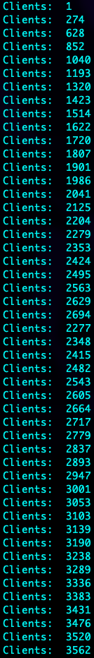
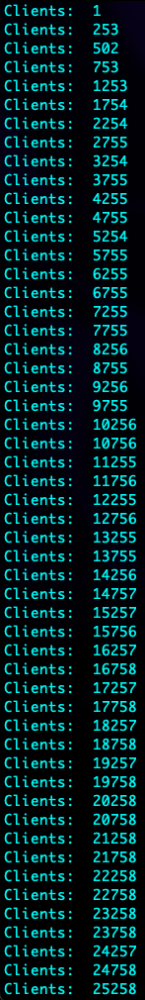
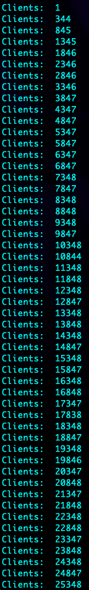
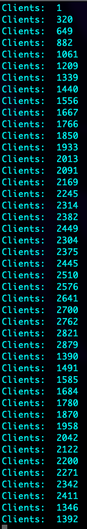
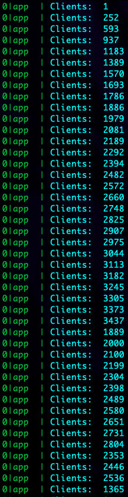
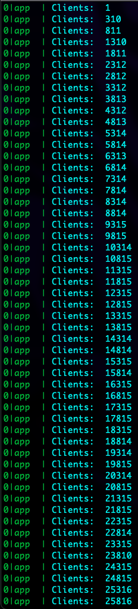

# SocketIO Performance Test
This repo is to demonstrate SocketIO performance when broadcasting to thousand of clients.

In this test, we have a very simple socketio server that mostly does nothing. It accepts connection then broadcast a Hello World message to all clients.

# Test overview
## Environment

This test is run on an Ubuntu Virtual Machine with 4CPU, 8GB RAM. And setup with all [Performance tuning](https://socket.io/docs/v4/performance-tuning/) recommended from SocketIO official homepage

Test script: use Artillery, does nothing, just connect and sleep there, each test script produces 20k concurrent users. See `main.yml` for detail
## Run the test
### Without Docker
First run:
```
npm install
```
Then run:
```
npm start
```
Finally run test script:
```
npm run test
```
### With Docker
First build Docker image:
```
docker build -t test-socketio .
```
Start the app
```
docker run -dit \
  -p 3000:3000 \
  test-socketio
```
Finally run test script:
```
npm run test
```
# Result
- when broadcasting to thousand of clients using `socket.broadcast...`, SocketIO performance is quite poor, number of clients connected increases slowly, sometimes dropped
- when disabling broadcast, the number of connected clients increased significantly. I did make it bumped up to 100k connections

> Performing this test in a namespace produces same result

<table>
  <tr>
    <th>Environment</th>
    <th>Result</th>
  </tr>
  <tr>
    <td>Docker Alpine - With broadcast message</td>
    <td>
      
    </td>
  </tr>
  <tr>
    <td>Docker Alpine - No broadcast</td>
    <td>
      
    </td>
  </tr>

  <tr>
    <td>Docker Debian - With broadcast message</td>
    <td>
      
    </td>
  </tr>
  <tr>
    <td>Docker Debian - No broadcast</td>
    <td>
      
    </td>
  </tr>

  <tr>
    <td>Ubuntu (PM2) - With broadcast message</td>
    <td>
      
    </td>
  </tr>
  <tr>
    <td>Ubuntu (PM2) - No broadcast</td>
    <td>
      
    </td>
  </tr>
</table>